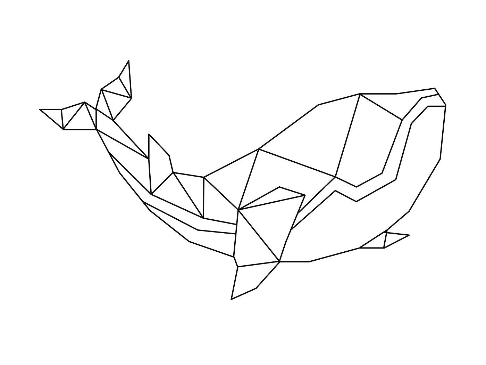
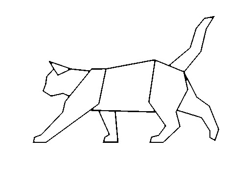

# lasertools

Simple image processing tools for use with a laser cutter or similar





# Installation

First, clone the repository:

```sh
git clone https://github.com/Loud-Cat/lasertools.git
```

Then, set up the environment (note: for GUI displays, tkinter is required)
```sh
python -m venv venv
venv/bin/python -m pip install Pillow
```

# Usage

Once you have set up the virtual environment, enter it:

```sh
source venv/bin/activate
```

To exit the virtual environment, type `deactivate` in the shell.

To run the program, enter the `src` directory with `cd src/`

Finally, you can run either of the two programs using `python` from the shell. Here are some examples:

```py
python linescan.py examples/cat.jpg points/cat.txt
python drawpoints.py points/cat.txt
python drawpoints.py examples/whale.jpg
```
